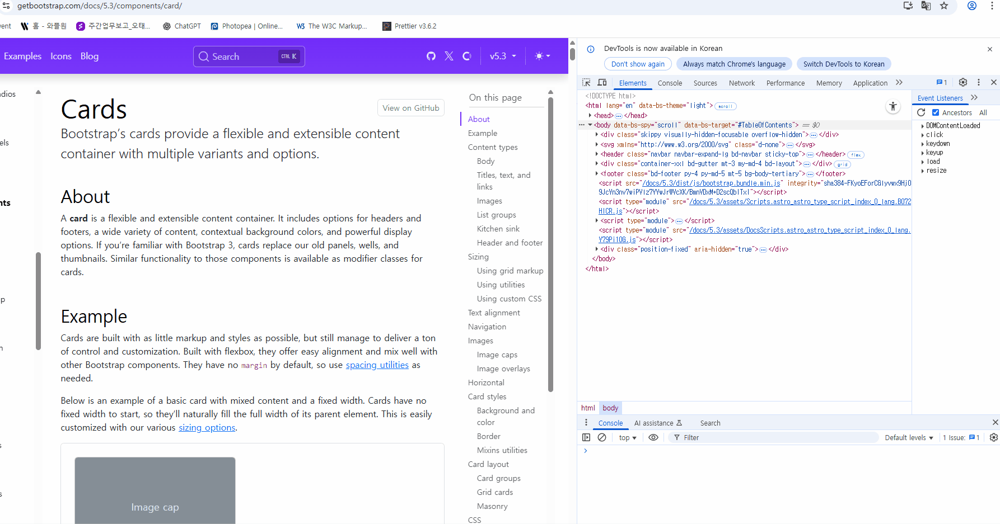

# DOM Origin Tracers (DevTools snippets)

Console-only, zero-setup **DevTools snippets** to reveal **who changed your DOM** — with best-guess origins that play nicely with bundlers and DevTools VM stacks.

> Paste → Run → See origin.  
> No build. No npm. No bookmarklet.

---

## Snippets

### 1) `class-origin-tracer.js`
Finds who toggled your classes and where.

- **Hooks:** `classList.*`, `setAttribute('class')`, `className` setter, SVG `baseVal`, jQuery `add/remove/toggleClass`, attr('class'), prop('className')
- **Nice bits:** noise-killer (interval/RAF/timeout), repeat throttling, same-origin iframe auto-inject, optional bridge to top
- **Docs:** **[CLASS_README.md](CLASS_README.md)**  
- **Source:** [`src/class-origin-tracer.js`](src/class-origin-tracer.js)  
- **Demo:** 

---

### 2) `child-origin-tracer.js`
Catches who added/removed children (append/prepend/before/after, remove, inner/outerHTML, jQuery DOM ops).

- **Hooks:** `append/insertBefore/remove/replaceChild`, `Element.append/prepend/before/after`, `ChildNode.remove`, `innerHTML/outerHTML`, jQuery `append/prepend/before/after/html/remove/detach/empty`
- **Nice bits:** noise-killer + throttling, ‘+ / −’ 우선 매칭 with '?' as last-resort fallback, iframe auto-inject + bridge
- **Docs:** **[CHILD_README.md](CHILD_README.md)**  
- **Source:** [`src/child-origin-tracer.js`](src/child-origin-tracer.js)  
- **Demo:** 

---

## Quick install (DevTools Snippets)
1) Open **Chrome DevTools → Sources → Snippets → New Snippet**  
2) Name it with the filename (e.g., `class-origin-tracer.js`) and paste the source.  
3) Click **Run (▶)**.  
4) Optional (per snippet):
```js
// Class
__TRACEv17.help();     // one-page tips
__TRACEv17.debug();    // show origin stacks
__TRACEv17.filterPreset('aggressive'); // kill noisy churn
__TRACEv17.set({ bridgeToParent: true }); // aggregate iframe logs at top

// Child
__CHILDTRACEv1.help();
__CHILDTRACEv1.debug();
__CHILDTRACEv1.filterPreset('aggressive');
__CHILDTRACEv1.set({ bridgeToParent: true });
```

Privacy: logs stay in your Console. Nothing is sent anywhere.

## License
[MIT LICENSE](LICENSE)