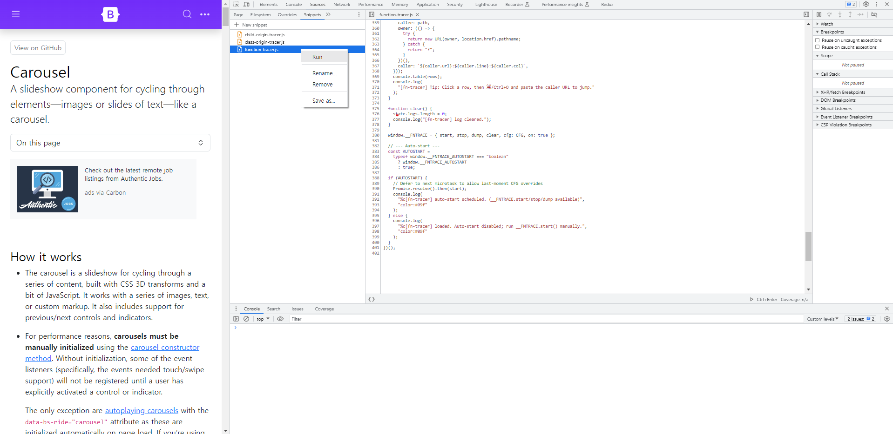

# Chrome DevTools snippets

> Paste → Run → See origin.  
> No build. No npm. No bookmarklet.

## To Use DevTools Snippets in Chrome

You can read more about [snippets at the Chrome Developer Tools documentation.](https://developer.chrome.com/docs/devtools/javascript/snippets?hl=en)
- **Open Chrome devtools.**
- Go to **“Sources → Snippets”**, and add whichever ones you want.
- Paste the code, name the snippet, and **click Run (▶).**

## Snippets

### DOM Origin & Debugging

- [`class-origin-tracer.js`](snippets/class-origin-tracer) — **Traces who changed your DOM classes**; bundle/VM-friendly origins, built-in noise filters (interval/RAF/timeout), same-origin iframe auto-inject, optional bridge to top.

- [`child-origin-tracer.js`](snippets/child-origin-tracer) — **Traces who added/removed DOM children** (append/prepend/before/after, remove, inner/outerHTML, jQuery); noise filters + iframe support; ‘`+` / `−` first, `?` last-resort matching.

- [`function-tracer.js`](snippets/function-tracer) — 

## Contributing

PRs welcome! Keep each snippet single-file, run Prettier, and include a short repro/screenshot.

## License
[MIT LICENSE](LICENSE)