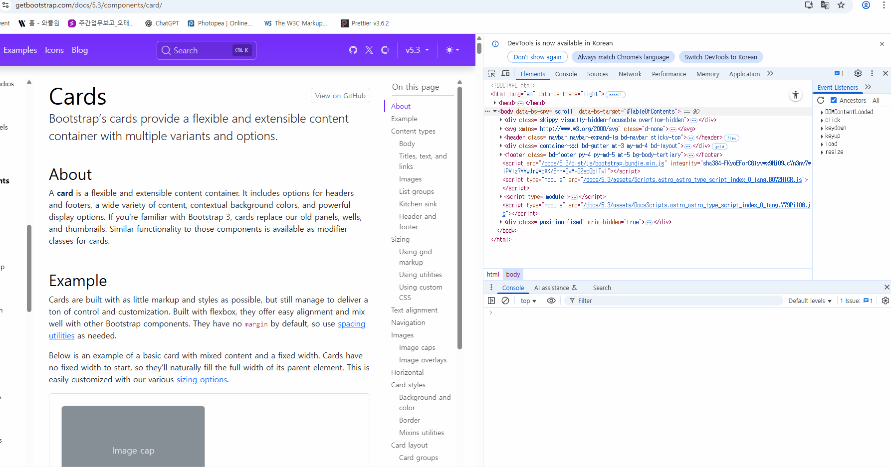

# DOM Origin Tracers (DevTools snippets)

Console-only, zero-setup **DevTools snippets** to reveal **who changed your DOM** — with best-guess origins that play nicely with bundlers and DevTools VM stacks.

> Paste → Run → See origin.  
> No build. No npm. No bookmarklet.

---

## Snippets

### 1) `class-origin-tracer.js`
Traces **who changed your DOM classes** and where it happened.

- **Hooks:** `DOMTokenList.add/remove/toggle`, `Element.setAttribute('class', ...)`, the `className` setter, and jQuery’s `addClass` / `removeClass` / `toggleClass` / `attr('class')` / `prop('className')`.
- **Docs:** **[CLASS_README.md](CLASS_README.md)**  
- **Source:** [`src/class-origin-tracer.js`](src/class-origin-tracer.js)  
- **Demo:** 

---

### 2) `child-origin-tracer.js`
Traces **who added/removed DOM children** (append/prepend/before/after, remove, `inner/outerHTML`, jQuery DOM manipulation) and where it happened.

- **Hooks:** `appendChild/insertBefore/removeChild/replaceChild`, `Element.append/prepend/before/after`, `ChildNode.remove`, `innerHTML` / `outerHTML`, and jQuery’s `append/prepend/before/after/html(set)/remove/detach/empty`.
- **Docs:** **[CHILD_README.md](CHILD_README.md)**  
- **Source:** [`src/child-origin-tracer.js`](src/child-origin-tracer.js)  
- **Demo:** 

---

## Quick install (DevTools Snippets)
1) Open **Chrome DevTools → Sources → Snippets → New Snippet**  
2) Name it with the filename (e.g., `class-origin-tracer.js`) and paste the source.  
3) Click **Run (▶)**.  
4) Optional: `debug()` to print origin stacks.

> Privacy: nothing leaves your browser. It only logs to the Console.

## License
[MIT LICENSE](LICENSE)