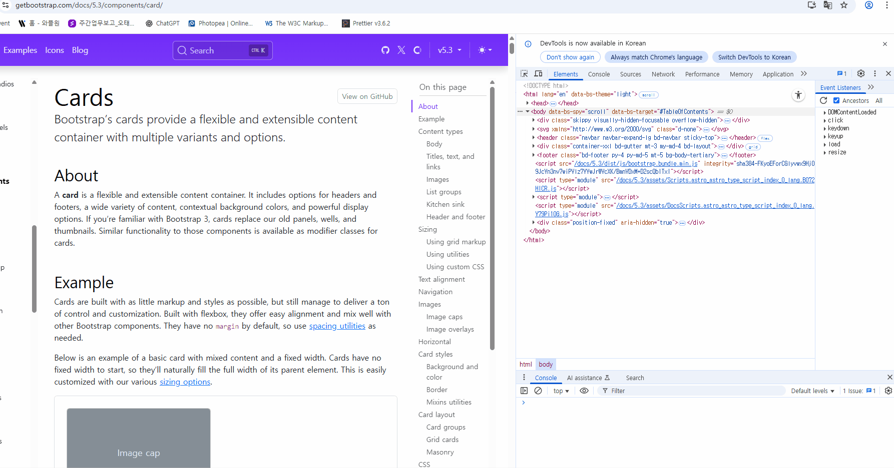

# class-origin-tracer

> **Who flipped your `.active`?**  
> A zero-setup DevTools snippet that traces **who changed your DOM classes** and where it happened.  
> Paste → Run → See origin.



## Why

Sliders, widgets, third-party scripts… UI states flicker, but the actual line of code that toggled your class is invisible.
This snippet hooks class mutations and prints, for each change:

- a readable CSS path of the target element,

- the diff (+added / -removed),

- a best-guess origin (callsite) that plays nicely with bundlers and DevTools VM stacks,

- and (in debug) the origin stack and the matching decision table.

No build. No npm. No bookmarklet. Just a snippet.

## Quick start (DevTools Snippet)

1. Open **Chrome DevTools → Sources → (left panel) Snippets → New Snippet**  
2. Name it `class-origin-tracer.js` and paste the contents of [`class-origin-tracer.js`](class-origin-tracer.js).  
3. Click **Run (▶)**.  
4. Interact with the page; the Console shows class changes and their origins

**Cheat sheet**
```js
__TRACEv17.help();                // one-time Quick Start banner
__TRACEv17.debug();               // origin stacks + decision tables
__TRACEv17.min();                 // quiet mode
__TRACEv17.filterPreset('aggressive'); // kill interval/RAF churn fast
__TRACEv17.set({ bridgeToParent: true }); // aggregate iframe logs in TOP window
```

## What it hooks

- DOM: `DOMTokenList.add/remove/toggle`, `Element.setAttribute('class', ...)`, `className` setter, SVG `className.baseVal`

- jQuery: `addClass` / `removeClass` / `toggleClass` / `attr('class')` / `prop('className')`

> jQuery core/migrate frames are hidden by default (`skipJQCore: true`). Your app/plugins still show up.

## Noise & Dedupe (made for real UIs)

When classes change on a schedule (auto-rotating sliders, timers, animations), the console gets noisy. Use built-in filters to keep only the useful first hits and summaries.

```js
// Quick, sensible defaults:
__TRACEv17.filterPreset('aggressive');

// Or tune manually:
__TRACEv17.set({
  filter: {
    interval: { ignore: true,  showFirst: 1 }, // setInterval: show first N, then suppress
    raf:      { ignore: true,  showFirst: 1 }, // rAF-driven loops: same idea
    timeout:  { ignore: false, showFirst: 1 }, // recursive setTimeout polling (toggle if needed)
    throttleMs: 300,                            // same signature within 300ms → muted
    maxRepeats: 5,                              // show at most 5 times per signature, then summarize
    summaryEvery: 50                            // print 1-line summary every 50 suppressed
  }
});

__TRACEv17.resetDedupe(); // clear throttling/repeat counters
```

A signature is roughly: callsite (`url:line:col`) + target element + set of class additions/removals.
It keeps repeated noise from the same place out of your way.

## Iframes (same-origin)

- Auto-inject into same-origin iframes is ON by default.

- For iframe-heavy pages, aggregate to the top window:

```js
__TRACEv17.set({ bridgeToParent: true }); // forward logs to TOP; child consoles stay quiet
```

> Cross-origin iframes cannot be inspected due to browser security.

## Commands

```js
__TRACEv17.help();                 // show Quick Start
__TRACEv17.min();                  // minimal logs (no stacks/decision tables)
__TRACEv17.debug();                // detailed logs + origin stacks
__TRACEv17.stop();                 // detach the observer
__TRACEv17.dump($0);               // show recent ops buffer for the selected element
__TRACEv17.set({ windowMs: 2000 }); // widen op↔mutation matching window (ms)
__TRACEv17.resetDedupe();          // reset noise counters
__TRACEv17.filterPreset('off');    // disable all filters
```

## Matching policy (how origins are picked)

- Score = API kind weight + sign match (+/−) + class name hits + recency

- If no clear +/− candidate exists, '?' (unknown) is considered only as the final fallback

- Callsite extraction prefers bundle/VM/relative frames (webpack-internal://, blob:, file:, relative paths),
skips extensions/devtools internal, jQuery core/migrate, and the snippet itself

## Configuration (summary)

```js
// defaults inside class-origin-tracer.js
const CFG = {
  windowMs: 1200,
  perElMax: 24,
  verbose: false,           // show decision table
  showStacks: "none",       // 'none' | 'origin'
  ctxLines: 2,

  crossFrameInject: true,   // auto-inject into same-origin iframes
  bridgeToParent: false,    // postMessage events to top window
  skipJQCore: true,         // hide jQuery core/migrate frames

  filter: {
    interval: { ignore: true,  showFirst: 1 },
    raf:      { ignore: false, showFirst: 1 },
    timeout:  { ignore: false, showFirst: 1 },
    throttleMs: 250,
    maxRepeats: 8,
    summaryEvery: 50,
    reportSuppressed: true
  }
};
```

## Browser support & limits

- Best on Chromium browsers (Chrome/Edge). Firefox/Safari stack formats may reduce callsite precision.

- Only same-origin documents/iframes can be traced.

- With hot reload/sourcemaps, line:col may move often, making signatures look different; use throttleMs/maxRepeats to tame it.

> Privacy: logs stay in your local Console. Nothing is sent anywhere.

## Contributing

- Single source file: snippets/class-origin-tracer/class-origin-tracer.js (no build/min)

- Run Prettier before committing

- Please include a short console screenshot and repro steps when filing issues

## LICENSE

[MIT LICENSE](/LICENSE)
