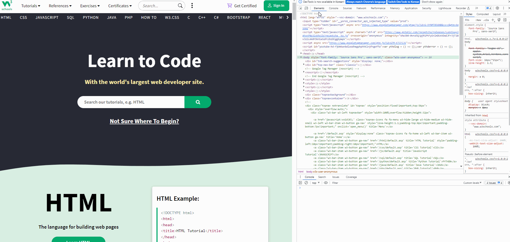

# function-tracer

> Who called what, when, and from where.  
> A zero-setup DevTools snippet that traces same-origin app functions (not vendor libs), logs call order, Δ time, callee path, and caller `file:line:col`.  
> Paste → Run → Watch the flow.


> Demo: Tracing function calls on the w3schools site.

## Why

When a page boots and reacts to user input, the actual call chain often disappears behind bundlers, frameworks, or timers.
This snippet lightly wraps your app’s own functions (same-origin) and hooks event/timer/rAF callbacks so you can see:

- the call order with running time delta,

- the callee path (e.g. window.App.search.run),

- the caller location (url:line:col, friendly to bundled/VM stacks),

- and (optionally) a compact arguments sketch.

No build. No npm. No bookmarklet. Just a snippet.

## Quick start (DevTools Snippet)

1. Open **Chrome DevTools → Sources → (left panel) Snippets → New Snippet**
2. Name it function-tracer.js and paste the contents of [`function-tracer.js`](function-tracer.js)
3. Click **Run (▶)**. It **auto-starts** by default.
4. Interact with the page; open Console to see calls.

**Optional before running (in Console)**

```js
// Disable auto-start if you want to tweak config first:
window.__FNTRACE_AUTOSTART = false;

// Override config (examples):
window.__FNTRACE_CFG = {
  excludeLibRe: /\b(jquery|react|lodash|vendor)\b/i,
  maxWrap: 500,
  namespaceHints: ["App", "MYAPP"]
};
```

**Cheat sheet**
```js
__FNTRACE.start();   // (re)start tracing
__FNTRACE.stop();    // restore originals and stop
__FNTRACE.dump();    // print a summary table of captured calls
__FNTRACE.clear();   // clear in-memory logs
__FNTRACE.cfg;       // current config object
```

## What it traces

- Global/namespace functions that belong to same-origin scripts and are not obvious libraries (regex-based exclude).

- Callback entrypoints registered after the snippet runs:

    - `addEventListener(...)`
    - `setTimeout` / `setInterval`
    - `requestAnimationFrame`

> Already-registered callbacks before you run the snippet are held by the browser and won’t be wrapped.  
> For best coverage: **reload → run → interact**.

## Output format

A typical console line:

```pgsql
[fn-trace #191 +480817.5ms] window.search.showMyKeyword → (http://site/js/searchAPI.js?:232:11) args=["foo","bar"]
```

- `#191` — sequential **call number**

- `+480817.5ms` — **elapsed** since tracing started

- `window.search.showMyKeyword` — **callee path**

- `→ (…:232:11)` — **caller** `url:line:col` (same-origin frame preferred)

- `args=…` — compact **argument sketch** (functions shown as `ƒ(name)`, elements as `<div…>`)

Use `__FNTRACE.dump()` for a table view.

## How functions are selected

- The snippet fetches **same-origin** `<script src>` contents and keeps a normalized copy (whitespace/comments stripped).

- When it sees a function reference on `window` (and hinted namespaces), it compares the function’s `toString()` (normalized) against those sources.

- If there’s a match, it’s considered **“your app code”** and gets wrapped.

- It **skips** paths that look like vendor libs (`excludeLibRe`) and min/legacy files by default.

## Configuration (summary)

```js
// defaults inside function-tracer.js
const DEFAULT_CFG = {
  maxWrap: 800,                 // safety cap on how many functions to wrap
  maxDepth: 3,                  // object graph traversal depth under window
  includeSameOriginOnly: true,  // only wrap functions from same-origin scripts
  excludeLibRe: /\b(jquery|bootstrap|highcharts|slick|react|preact|vue|angular|lodash|underscore|moment|dayjs|gtag|ga|hotjar|amplitude|kakao|naver|daum|d3|three|chart|tabulator)\b/i,
  excludeSrcRe: /\.(min|legacy)\.js($|\?)/i,
  namespaceHints: ["App", "APP", "app", "NS", "Project"],
  showArgs: true,               // print compact argument JSON
  maxArgLen: 120,               // truncate long arg logs
};
```

> Tip: Add your own namespaces (e.g., namespaceHints: ["MY", "Project"]) for better coverage with less traversal.  
> If your app code lives in a file that matches the library regex, relax excludeLibRe.

## Limits & notes

- **ES modules**: functions hidden in module scope are hard to reach; you’ll still see their **callbacks** when they register event/timer/rAF handlers.

- **Previously-stored references** (e.g., `const f = App.run; f()`) created before wrapping may bypass wrappers.

- **Non-writable / non-configurable** properties aren’t replaced.

- **Same-origin only**: cross-origin scripts/iframes can’t be inspected due to browser security.

- **Performance**: defaults are conservative. If your app exports tons of functions, start with a smaller `maxWrap` or add more `namespaceHints`.

> Privacy: All logs stay in your local DevTools Console. Nothing is sent anywhere.

## Contributing

- Single source file: snippets/function-tracer/function-tracer.js (no build/min)

- Run Prettier before committing

- Please include a short console screenshot and repro steps when filing issues

## LICENSE

[MIT LICENSE](/LICENSE)
